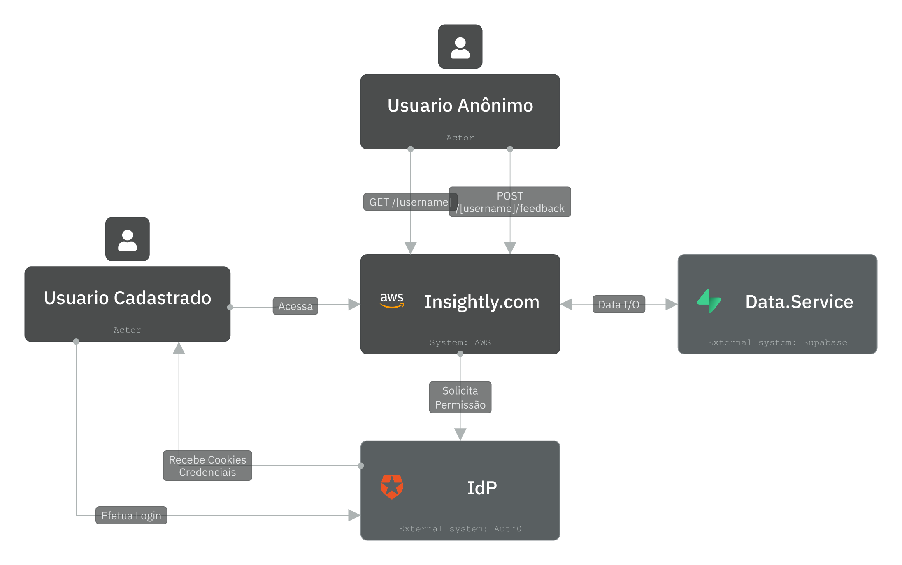
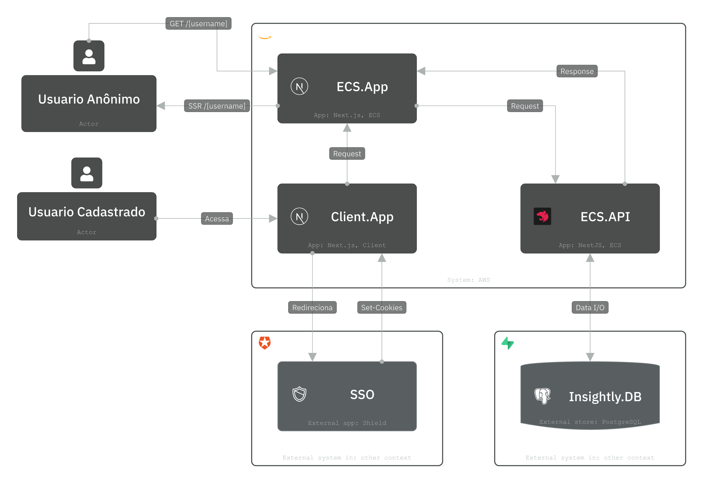
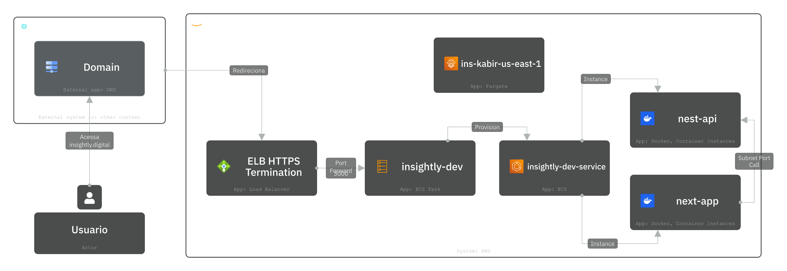

# Insightly - Sistema de Perfis e Feedback

> 💼 **Projeto desenvolvido como teste técnico para uma entrevista**

Uma aplicação web simples construída com NestJS + Next.js para gerenciamento de perfis de usuários e sistema de feedback. O projeto demonstra conhecimentos em desenvolvimento full-stack, containerização Docker e deploy em cloud.

## 📁 Estrutura do Projeto

### [`/api`](./api/)
Backend NestJS com TypeScript, TypeORM e PostgreSQL. Fornece APIs RESTful para operações CRUD de usuários, links sociais e sistema de feedback. Documentação completa disponível no README do diretório.

### [`/app`](./app/)  
Frontend Next.js 15 com App Router, TypeScript e Tailwind CSS. Interface responsiva com autenticação Auth0 e integração completa com o backend. Documentação detalhada no README específico.

### [`/docs`](./docs/)
Documentação técnica do projeto incluindo diagramas de arquitetura, modelo de dados e especificações de deploy. Contém diagramas C4 e documentação de banco de dados.

## 🚀 Deploy Local com Docker

### Pré-requisitos
- Docker e Docker Compose instalados
- Portas 3000, 3001 e 5432 disponíveis

### Execução
```bash
# Clonar o repositório
git clone https://github.com/JPRodriguesC/insightly.git
cd insightly

# Construir o Compose
docker compose build

# Executar com up
docker compose up -d

# Acessar a aplicação
# Frontend: http://localhost:3000
# API: http://localhost:3001
# Swagger: http://localhost:3001/api
```

### Serviços
- **PostgreSQL**: Banco de dados com inicialização automática via SQL script
- **API NestJS**: Backend executando na porta 3001
- **Frontend Next.js**: Interface web na porta 3000

## 🏗️ Arquitetura do Sistema

A arquitetura do Insightly segue os princípios de Clean Architecture com separação clara de responsabilidades:

### Diagrama Entidade-Relacionamento


*Estrutura do banco de dados PostgreSQL com entidades Usuario, Links e Feedback*

### Contexto da Aplicação  


*Visão geral do sistema mostrando atores, integrações externas e fluxos principais*

### Arquitetura de Containers


*Decomposição da aplicação em containers C4 com suas responsabilidades e comunicação*

### 🔗 Visualização Interativa
Para uma experiência completa dos diagramas C4 com navegação interativa, acesse:
**[https://s.icepanel.io/ocjg29TDL6kOC0/yOHS](https://s.icepanel.io/ocjg29TDL6kOC0/yOHS)**

## ☁️ Deploy em Produção (AWS)

### Arquitetura de Deploy na AWS


*Infraestrutura AWS utilizando ECS*


## 🔐 Autenticação e Dependências Externas

### Auth0 Integration
A aplicação possui **dependência obrigatória** do Auth0 para autenticação de usuários:

- **Funcionalidade**: Login/logout, gestão de sessões e proteção de rotas
- **Configuração**: Variáveis de ambiente necessárias (CLIENT_ID, CLIENT_SECRET, DOMAIN)
- **Integração**: SDK oficial @auth0/nextjs-auth0 com middleware personalizado
- **Segurança**: Tokens JWT, CORS configurado e cookies seguros

### Configuração Auth0:
```bash
# Variáveis obrigatórias no .env.local
AUTH0_SECRET='generated-secret-key'
AUTH0_BASE_URL='http://localhost:3000'
AUTH0_ISSUER_BASE_URL='https://your-domain.auth0.com'
AUTH0_CLIENT_ID='your-client-id'
AUTH0_CLIENT_SECRET='your-client-secret'
```

---

## 🛠️ Tecnologias Principais

**Backend**: NestJS, TypeORM, PostgreSQL (Supabase), Swagger, Jest  
**Frontend**: Next.js, TypeScript, Tailwind CSS, Auth0  
**Infraestrutura**: Docker, Docker Compose, AWS ECS  
**Qualidade**: ESLint, Prettier, Unit Tests

---

*Desenvolvido como demonstração de habilidades técnicas em desenvolvimento full-stack moderno* 🚀
